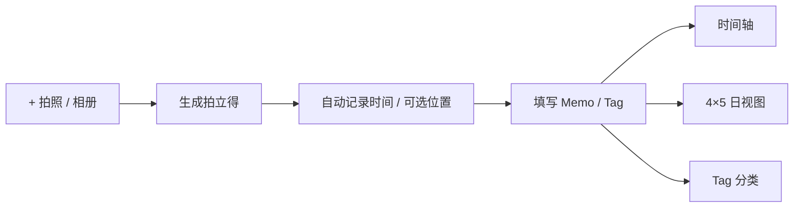

# 时光拍立得 · Hourly Photo Diary

> 用照片而不是任务填满一天：按小时记录，在时间轴、日视图和 Tag 中重新发现生活。

[](https://expo.dev/)
[](https://reactnative.dev/)
[](https://www.typescriptlang.org/)

**[打开 Web 体验版](https://rdchengcheng.github.io/photo-diary/?demo=1)**

Web 用于快速体验界面和核心流程；相机、系统通知、定位、SQLite 与原生文件能力以 iOS / Android development build 为准。

## 为什么做

多数日历记录“要做什么”，照片日记记录“这段时间真实发生了什么”。一期只解决三个问题：

1. **低摩擦记录**：右下角 `+` 完成现场拍照或相册补录。
2. **明确时间感**：每天是连续 20 个小时，跨午夜仍属于同一个日记日。
3. **可重新发现**：同一份照片可以按日期、小时或 Tag 回看。

## 核心体验



- 时间轴：20 个小时节点；多图自适应平铺或叠放。
- 拍立得：每张照片独立保存时间、位置、Memo、Tag 与补录状态。
- 日视图：固定 `4×5` 网格，加一段独立的“今日总结”。
- Tag：可创建、复用、重命名、删除，并提供“未标记”入口。
- 本地优先：无账号、无自动云同步，离线仍可记录和回看。
- 主动备份：AES-256-GCM 加密导出与恢复。

## 架构

```text
src/
├─ domain/    20 小时时间规则与业务模型
├─ data/      Repository、SQLite 与 Web 适配器
├─ services/  媒体、通知、位置与加密备份
├─ state/     用例编排与应用状态
├─ screens/   时间轴、日视图、Tag
└─ ui/        拍立得、编辑器、骨架屏与导航
```

边界保持简单：展示层不直接操作存储，原生能力经 Service 隔离，业务规则保持可测试。

## 本地运行

要求 Node.js `22.13+` 与 pnpm `11.19+`。

```bash
pnpm install --frozen-lockfile
pnpm web
```

打开终端给出的地址；追加 `?demo=1` 可载入演示数据。

原生 development build：

```bash
pnpm exec expo run:android --device
pnpm exec expo run:ios --device
```

## 验证

```bash
pnpm check
pnpm export:web
```

当前状态：TypeScript、Vitest、Expo 依赖检查和 Web / Android / iOS bundle 已通过；权限、通知、相机、定位、故障恢复和终端适配仍需分别完成 Android / iOS 真机签字。

## 产品边界

一期不包含社交、公开分享、AI 分类、云同步和多用户协作。Web 体验版的数据保存在当前浏览器中，不与其他访问者共享。
