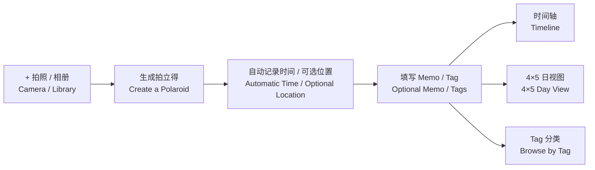
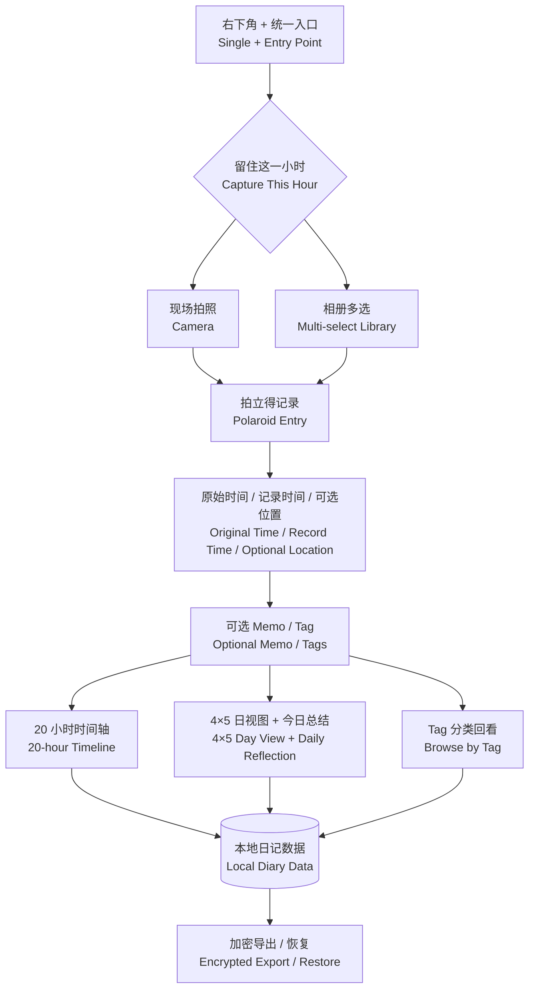

# 时光拍立得 · Hourly Photo Diary

> **用一张照片，完成一段日记。**  
> **Turn one photo into a moment worth remembering.**

为想记录生活、却总是很难开始写日记的人设计。  
Designed for people who want to record their lives but find traditional journaling hard to begin.

[](https://expo.dev/)
[](https://reactnative.dev/)
[](https://www.typescriptlang.org/)

**[在线体验 · Live Demo](https://quinny0y.github.io/photo-diary/?demo=1)**

> Web 版本用于体验界面与核心流程；相机、定位、通知、SQLite 和原生文件能力以 Android / iOS development build 为准。  
> The Web version demonstrates the interface and core flows. Camera, location, notifications, SQLite, and native file behavior require Android or iOS development builds.

---

## 为什么做 / Why It Exists

很多人想记录生活，却很难长期坚持写日记。

问题通常不是缺少值得记录的事情，而是写作要求我们停下来回忆、组织语言，再把一天整理成完整的文字。记录尚未开始，负担已经出现。

照片提供了更轻的入口。再次看到一张照片时，我们往往会自然想起画面之外的人、声音、地点、心情和故事。

Many people want to remember their lives but struggle to maintain a written journal.

The problem is rarely a lack of meaningful moments. Writing asks us to stop, reconstruct the day, organize our thoughts, and turn them into complete sentences. The effort often appears before the first entry is created.

A photo offers a lighter entry point. Seeing it again can naturally recall the people, sounds, place, mood, and story beyond the frame.

---

## 产品定义与第一性原理 / Product Definition & First Principle

**时光拍立得是一款低门槛的生活记录工具。**

用户只需拍下一张照片，或从相册补录过去的片刻。系统自动按照时间组织记录，并允许选择性补充 Memo、位置和 Tag。

照片不是记录的终点，而是未来重新进入这段记忆的入口。

**Hourly Photo Diary is a low-friction way to record everyday life.**

Take a photo or bring an earlier moment back from the library. The product organizes it by time and optionally adds a memo, location, or tag.

The photo is not the destination of the record. It is the doorway back into the memory.

### 最小有效记录 / The Smallest Useful Record

> **一个足以在未来唤回记忆的线索。**  
> **One cue powerful enough to bring the memory back.**

```text
留下一个瞬间                Capture one moment
      ↓                            ↓
让时间自动组织它            Let time organize it
      ↓                            ↓
让未来的自己重新看见它      Let your future self see it again
```

Memo、Tag 和位置可以增强记忆，但不应成为完成记录的前提。  
Memos, tags, and locations may strengthen a memory, but they are never required to complete a record.


## 从用户问题到产品决策 / From User Problem to Product Decision

| 阶段 / Stage | 用户洞察 / User Insight | 产品回应 / Product Response |
| --- | --- | --- |
| **Empathize · 共情** | 用户想记录生活，但写日记需要时间、语言组织和持续意志。<br/>People want to remember their lives, but writing requires time, language, and sustained motivation. | 从已经熟悉的拍照动作开始，不要求先写文字。<br/>Begin with the familiar act of taking a photo, without requiring text. |
| **Define · 定义** | 真正的问题不是没有记录工具，而是一次记录的启动成本太高。<br/>The real problem is not a lack of tools, but the high cost of starting each record. | 把最小记录单元从“一篇日记”缩小为“一张能唤回记忆的照片”。<br/>Reduce the smallest unit from a written entry to a photo that can bring the memory back. |
| **How might we · 设计命题** | 如何让用户几秒钟就能留下今天，同时让记录多年后仍然有意义？<br/>How might someone preserve today in seconds while keeping it meaningful years later? | 自动保存时间语境，以拍立得和日视图形成值得回看的结构。<br/>Preserve time automatically and present moments in a form worth revisiting. |
| **Ideate · 构想** | 记录、整理和保存不需要在同一时刻完成。<br/>Capturing, organizing, and preserving do not need to happen at the same time. | 当下只负责捕捉，系统随后组织，未来再完成回看、导出和成册。<br/>Capture now, let the system organize, and compile when the user is ready. |
| **Prototype · 原型** | 最短流程必须足够明确。<br/>The shortest path must be unmistakable. | `+ → 拍照/相册 → 自动生成拍立得 → 完成`。Memo 与 Tag 始终可选。<br/>`+ → camera/library → automatic polaroid → done`. Memos and tags remain optional. |
| **Test · 验证** | 功能数量不能证明产品有效。<br/>Feature count cannot prove the product works. | 验证首次记录完成率、完成时间、主动回看和导出意愿。<br/>Measure first-entry completion, time-to-save, revisiting, and export intent. |

---

## 核心体验 / Core Experience



### 1. 从一个入口开始 / Begin from One Entry Point

时间轴右下角的 `+` 同时支持现场拍照和相册多选。用户不需要先决定写什么，也不需要填写完整表单。

The `+` button supports both camera capture and multi-select from the photo library. There is no form or writing requirement before recording.

### 2. 自动形成拍立得日记 / Create a Polaroid Entry Automatically

照片保存后自动记录原始时间、日记日期、所属小时及可选位置。照片本身即构成一次完整记录，Memo 与 Tag 均为增强项。

Each saved photo becomes a polaroid-style entry containing its original time, diary date, hour, and optional location. The photo alone completes the record; memos and tags remain enhancements.

### 3. 让时间组织生活 / Let Time Organize Life

记录可以按照一天的时间顺序回看，也可以通过日视图或 Tag 跨越日期重新发现。

Moments can be revisited chronologically, gathered into a day view, or rediscovered across dates through tags.

---

## 当前能力 / Current Capabilities



- **时间轴 / Timeline**  
  20 个小时节点；多张照片自适应平铺或叠放。  
  Twenty hourly points with adaptive tiled or stacked photo layouts.

- **拍立得记录 / Polaroid Entries**  
  保存原始时间、记录时间、可选位置、Memo、Tag 与补录状态。  
  Preserve original time, record time, optional location, memo, tags, and backfill state.

- **日视图 / Day View**  
  固定 `4 × 5` 网格，并提供独立的今日总结。  
  A fixed `4 × 5` grid with an independent daily reflection.

- **Tag 分类 / Tags**  
  支持创建、复用、重命名、删除和未标记入口。  
  Create, reuse, rename, delete, and browse untagged entries.

- **本地优先 / Local-first**  
  无需账号，离线可用，并支持加密导出与恢复。  
  No account required, available offline, with encrypted export and recovery.

---

## 为谁设计 / Who It Is For

适合想记录每天发生了什么，却不知道如何开始写日记的人；也适合手机里保存了许多照片，却很少重新回看，并希望未来可以整理、打印和长期保存这些记忆的人。

Designed for people who want to remember their days but find writing difficult to begin; for those with many photos they rarely revisit; and for anyone who hopes to organize, print, and preserve personal memories over time.

---

## 产品原则 / Product Principles

| 原则 / Principle | 定义 / Definition |
| --- | --- |
| **记录先于创作**<br>Recording Before Creating | 记录不需要完整、精彩或适合发表。<br>A record does not need to be complete, impressive, or publishable. |
| **照片完成记录**<br>A Photo Completes the Record | 文字、位置和 Tag 始终可选。<br>Text, location, and tags always remain optional. |
| **系统负责组织**<br>Let the System Organize | 用户留下瞬间，系统处理时间、日期、分类和版式。<br>The user captures; the system handles time, date, classification, and layout. |
| **允许一天留白**<br>Leave Space in the Day | 不要求填满所有小时，不用连续打卡制造压力。<br>No need to fill every hour or maintain a streak. |
| **记忆可以被带走**<br>Memories Must Be Portable | 数据可以导出、恢复、成册并长期保存。<br>Records can be exported, restored, compiled, and preserved. |

---

## 未来路线图 / Future Roadmap

> **更容易记录 → 更愿意回看 → 更适合成册 → 最终成为实体回忆录**  
> **Easier to record → worth revisiting → ready to compile → tangible as a memoir**

### Phase 1 · 手账化日常体验 / A Scrapbook-like Daily Experience

- 压缩空白小时和时间轴行距，一屏预览更多片刻；  
  Compress empty hours and timeline spacing to reveal more of the day.

- 将日视图设计成一整页手账纸；  
  Redesign the day view as a complete scrapbook page.

- 提供克制的纸张、胶带、贴纸、手写标题、天气和心情元素。  
  Add restrained paper, tape, sticker, handwritten title, weather, and mood elements.

### Phase 2 · 形成数字日记作品 / Create Digital Diary Works

- 将单日页面导出为高清图片或打印级 PDF；  
  Export daily pages as high-resolution images or print-ready PDFs.

- 自动生成周、月、年封面、目录、日期页和精选片刻；  
  Generate weekly, monthly, and yearly covers, indexes, dated pages, and highlights.

- 形成可保存、赠送和归档的数字小册子。  
  Create digital booklets that can be preserved, gifted, or archived.

### Phase 3 · 成为可以触摸的回忆录 / Create a Memoir You Can Hold

- 输出标准印刷文件并适配常见照片书尺寸；  
  Export standard print packages for common photo-book sizes.

- 按月或按年生成可直接打印的小册子；  
  Generate monthly and yearly booklets ready for printing.

- 在不绑定单一服务的前提下探索照片书制作。  
  Explore optional photo-book production without provider lock-in.

### 持续能力 / Ongoing Capabilities

日历、地图、收藏、搜索、“去年今天”、月度回顾、端侧辅助整理、加密同步和开放导入导出。

Calendar, map, favorites, search, “On this day,” monthly reflections, on-device assistance, encrypted sync, and open import/export.

所有智能能力默认保护隐私，并允许完全关闭。  
All intelligent features remain private by default, optional, and fully switchable.

---

## 隐私与所有权 / Privacy and Ownership

- 默认不要求账号，私人数据保存在用户设备中；  
  No account is required by default, and private data remains on the user’s device.

- 日记不会被自动公开；  
  Diary entries are never automatically published.

- Web 体验数据仅保存在当前浏览器；  
  Web demo data remains inside the current browser.

- 同步与智能能力必须可选、透明、可关闭；  
  Sync and intelligent features must remain optional, transparent, and switchable.

- 用户始终拥有原始照片和日记数据，并可以主动导出与恢复。  
  Users retain ownership of their photos and diary data, with explicit export and recovery controls.

---

## 如何验证产品成立 / How We Know It Works

产品是否成立，不取决于功能数量，而取决于：

Product value is determined not by feature count, but by whether:

- 用户能否快速完成第一条记录；  
  A new user can complete the first record quickly.

- 记录是否比传统文字日记更容易开始；  
  Recording feels easier to begin than traditional writing.

- 用户是否愿意自然留下多个片刻并主动回看；  
  People naturally capture several moments and voluntarily revisit them.

- 照片能否唤起画面之外的场景记忆；  
  A photo recalls the scene beyond its frame.

- 用户是否愿意将记录导出、成册或打印；  
  People want to export, compile, or print their records.

- 长期使用是否减少压力，而不是制造新的负担。  
  Long-term use reduces pressure instead of creating another obligation.

---

## 技术架构 / Technical Architecture

```text
src/
├─ domain/    日记日期、小时规则与业务模型
│             Diary dates, hourly rules, and business models
├─ data/      Repository、SQLite 与 Web 数据适配
│             Repository, SQLite, and Web persistence
├─ services/  媒体、位置、通知与加密备份
│             Media, location, notifications, and encrypted backup
├─ state/     应用状态与用例编排
│             Application state and use-case orchestration
├─ screens/   时间轴、日视图与 Tag
│             Timeline, day view, and tags
└─ ui/        拍立得、编辑器、骨架屏与导航
              Polaroids, editors, skeletons, and navigation
```

架构边界保持简单：

The architecture keeps its boundaries intentionally simple:

- 展示层不直接操作存储；  
  The presentation layer never accesses storage directly.

- 原生能力通过 Service 隔离；  
  Native capabilities are isolated behind services.

- Web 与原生端共享业务规则；  
  Web and native platforms share the same business rules.

- 时间归属、数据转换和恢复逻辑保持可测试；  
  Time assignment, data transformation, and recovery remain testable.

---

## 运行与验证 / Run & Verify

### Requirements

- Node.js `22.13+`
- pnpm `11.19+`

```bash
pnpm install --frozen-lockfile
pnpm web
```

在终端显示的地址后添加 `?demo=1`，即可载入演示数据。  
Add `?demo=1` to the local address to load demonstration data.

### Native Development Builds

```bash
pnpm exec expo run:android --device
pnpm exec expo run:ios --device
```

### Project Checks

```bash
pnpm check
pnpm export:web
```

当前 TypeScript 检查、自动化测试和 Web 导出均已通过。

TypeScript checks, automated tests, and Web export currently pass.

Web 端适合验证界面与主要信息流；权限、定位、通知、原生数据库、文件恢复和不同机型适配仍需在 Android 与 iOS 真机上分别验收。

The Web build is suitable for reviewing the interface and main information flow. Permissions, location, notifications, native persistence, file recovery, and device-specific layouts require physical Android and iOS verification.

---

> **今天留下一张照片，未来重新回到这一刻。**  
> **Capture one photo today. Return to the moment years from now.**

**[在线体验 · Open the Live Demo](https://quinny0y.github.io/photo-diary/?demo=1)**

---

## 制作声明 / Production Note

> **All AI-generated, except for product vision and editorial direction by QuinnY.**  
> **除产品创意与内容调试，全部由 AI 生成。**


