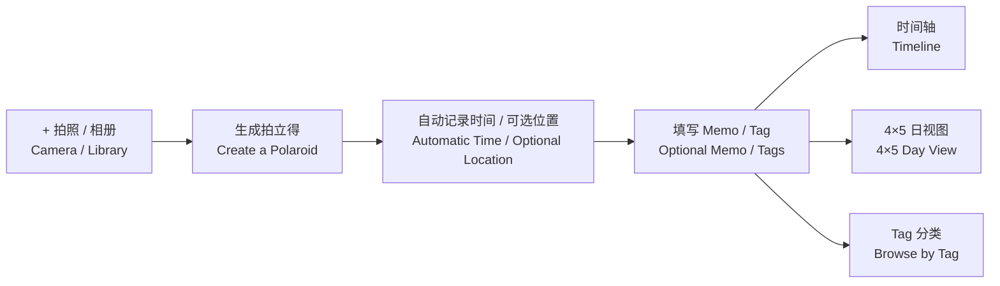
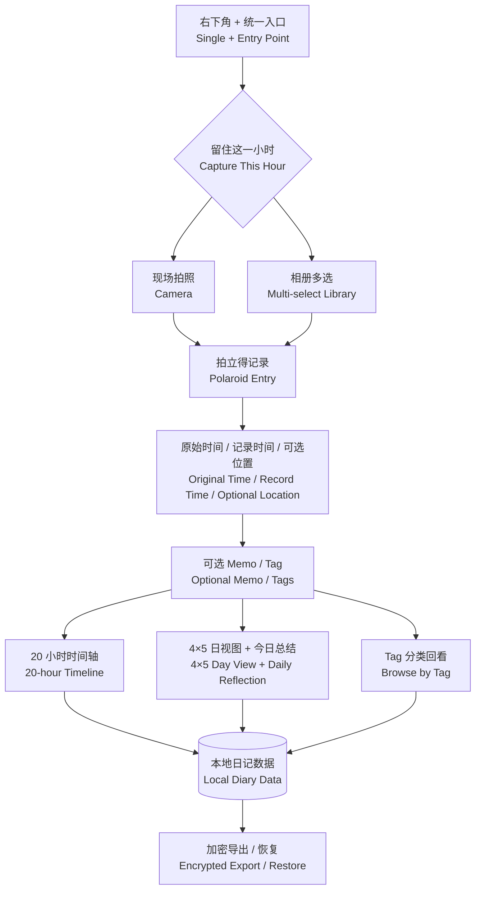

# 时光拍立得 · Hourly Photo Diary

> **用一张照片，完成一段日记。**
> **Turn one photo into a moment worth remembering.**

为想记录生活、却总是很难开始写日记的人设计。
Designed for people who want to record their lives but find traditional journaling hard to begin.

[](https://expo.dev/)
[](https://reactnative.dev/)
[](https://www.typescriptlang.org/)

**[在线体验 · Live Demo](https://quinny0y.github.io/photo-diary/?demo=1)**

> Web 版本用于快速体验界面与核心流程。相机、定位、系统通知、SQLite 和原生文件能力以 Android / iOS development build 为准。
> The Web version is intended for experiencing the interface and core flows. Camera, location, notifications, SQLite, and native file behavior should be evaluated through Android and iOS development builds.

---

## 为什么做 / Why This Exists

很多人并不是不想记录生活。

我们想记住普通一天里的早餐、路上的天空、一次散步，以及某个没有特别意义、以后却可能十分怀念的瞬间。

但传统日记要求我们停下来回忆、组织语言，再把一天写成一篇完整的文字。记录还没有开始，负担就已经出现了。

Many people genuinely want to remember their lives.

We want to keep the ordinary details of a day: breakfast, the sky on the way home, a short walk, or an unremarkable moment that may become precious years later.

Traditional journaling asks us to stop, reconstruct the day, organize our thoughts, and turn them into complete sentences. The effort often appears before the first entry is written.

与此同时，手机里已经留下了许多照片。它们看似零散，却拥有一种文字很难替代的能力：

> **当我们再次看到一张照片，常常会自然想起照片之外的人、声音、地点、心情，以及当天发生的故事。**

Meanwhile, our phones already contain countless photos. They may look fragmented, but they have a quality that writing often cannot replace:

> **When we see a photo again, we naturally remember what lies outside its frame—the people, sounds, place, mood, and story of that day.**

时光拍立得由此诞生：不要求你先学会坚持写日记，而是从一天中最容易完成的动作开始——留下一张照片。

Hourly Photo Diary begins with that insight. It does not ask you to become consistent at writing. It starts with one of the easiest actions you can take during the day: capturing a photo.

---

## 产品定义 / Product Definition

**时光拍立得是一款低门槛的生活记录工具。**

你只需要在一天中拍下几张照片，或者从相册补录过去的片刻。照片会自动按照时间组织，并可选择补充一句 Memo、位置或 Tag。

照片不是记录的目的，而是未来重新进入这段记忆的入口。

随着记录积累，这些片刻可以组成一天、一月和一年，最终成为可以导出、成册和打印的个人回忆录。

**Hourly Photo Diary is a low-friction way to record everyday life.**

Take a few photos throughout the day, or bring earlier moments back from your library. The app organizes them by time and lets you optionally add a memo, location, or tag.

The photo is not the purpose of the record. It is the doorway through which you can return to the memory.

As these moments accumulate, they can form a day, a month, and a year—eventually becoming a personal memoir that can be exported, compiled, and printed.

---

## 第一性原理 / First Principles

传统日记通常把“完成一篇文字”视为一次记录。

但如果记录的真正目的是让未来的自己能够想起今天，那么最小的有效记录并不一定是一篇文章，而可以是：

> **一个足以在未来唤回记忆的线索。**

Traditional journals often treat “finishing a piece of writing” as the smallest unit of a record.

But if the real purpose of journaling is to help your future self remember today, the smallest useful record does not need to be an essay. It can be:

> **One cue powerful enough to bring the memory back.**

照片正是这样的线索。它可以在极短时间内保留人物、地点、光线和情绪，并在未来触发人脑补全照片之外的故事。

A photo is such a cue. In seconds, it preserves people, place, light, and emotion. Years later, it can prompt the mind to reconstruct the story beyond the frame.

因此，产品只保留三个不可再删的环节：

The product therefore keeps only three irreducible steps:

```text
留下一个瞬间                Capture one moment
      ↓                            ↓
让时间自动组织它            Let time organize it
      ↓                            ↓
让未来的自己重新看见它      Let your future self see it again
```

Memo、Tag 和位置可以增强记忆，但不应成为完成记录的前提。

Memos, tags, and locations may strengthen a memory, but they should never be required to complete a record.

---

## 核心体验 / Core Experience



### 从一个低成本动作开始 / Begin with One Low-Cost Action

时间轴右下角的 `+` 是统一记录入口：

- 现场拍照，留住正在发生的片刻；
- 从相册选择一张或多张照片，补录过去的时刻。

用户不需要先决定写什么，也不需要填写完整表单。

The `+` button on the timeline is the single capture entry point:

- Take a photo of the moment happening now.
- Select one or more photos from the library to backfill an earlier moment.

There is no need to decide what to write or complete a form first.

### 自动形成拍立得日记 / Turn Each Moment into a Polaroid Entry

照片保存后自动生成拍立得形式，并记录：

- 拍摄或原始时间；
- 所属日记日期与小时；
- 可选的位置信息；
- 可选的 Memo 与 Tag。

照片本身已经构成一次完整记录，其余内容均为增强项。

After saving, every photo becomes a polaroid-style entry containing:

- Its capture or original time;
- Its diary date and hour;
- Optional location;
- Optional memo and tags.

The photo alone completes the record. Everything else is an enhancement.

### 用时间组织一天 / Let Time Organize the Day

时间轴将一天展开为连续的小时节点。它不要求每个小时都有内容。空白时间保持安静，有照片的时刻自然成为一天中的视觉锚点。

The timeline unfolds a day through continuous hourly points. Every hour does not need to be filled. Empty periods remain quiet, while captured moments become natural visual anchors.

### 用不同方式重新发现 / Rediscover Memories in Different Ways

- **时间轴 / Timeline**：重新经历一天的先后顺序；
- **日视图 / Day View**：在一页中看见当天留下的片刻；
- **Tag 分类 / Tags**：跨越日期，重新发现同一主题的生活片段。

The same records can be revisited through different contexts:

- **Timeline:** Relive the sequence of a day.
- **Day View:** See the moments of one day gathered on a single page.
- **Tags:** Rediscover related moments across different dates.

---

## 为谁设计 / Who It Is For

时光拍立得适合：

- 想记录每天发生了什么，却不知道如何开始写日记的人；
- 曾多次开始写日记，但因为负担太大而停止的人；
- 手机里有很多照片，却很少重新回看的人；
- 希望未来能把数字记忆整理、打印和长期保存的人。

Hourly Photo Diary is designed for people who:

- Want to remember what happened each day but do not know how to begin writing;
- Have repeatedly started and stopped traditional journals;
- Have many photos on their phones but rarely return to them;
- Hope to organize, print, and preserve their digital memories in the future.

---

## 产品原则 / Product Principles

### 记录先于创作 / Recording Before Creating

记录不需要完整、精彩或适合发表。产品首先帮助用户证明：这个瞬间曾经发生过。

A record does not need to be complete, impressive, or publishable. Its first job is simply to preserve the fact that a moment happened.

### 照片先于文字 / Photos Before Words

照片完成最基础的记录。文字、位置和 Tag 只在用户愿意时补充，不把回忆变成作业。

A photo completes the basic record. Text, location, and tags remain optional, so memory never becomes homework.

### 系统负责组织 / Let the System Organize

用户负责留下瞬间，系统负责处理时间、日期、分类和版式，减少每次记录前的选择。

The user captures the moment. The product handles time, date, classification, and layout, reducing decisions at the point of capture.

### 空白也是一天的一部分 / Empty Space Belongs to the Day

产品不要求填满所有小时，也不把普通生活变成需要完成的任务。

The product does not require every hour to be filled or turn ordinary life into another task to complete.

### 数字记忆最终可以被触摸 / Digital Memories Should Become Tangible

产品的长期终点不是无限增长的相册，而是可以导出、成册、打印并长期保存的个人回忆录。

The long-term destination is not an endlessly growing camera roll, but a personal memoir that can be exported, compiled, printed, and preserved.

---

## 从用户问题到产品决策 / From User Problem to Product Decision

| 阶段 / Stage | 用户洞察 / User Insight | 产品回应 / Product Response |
| --- | --- | --- |
| **Empathize · 共情** | 用户想记录生活，但写日记需要时间、语言组织和持续意志。<br/>People want to remember their lives, but writing requires time, language, and sustained motivation. | 从已经熟悉的拍照动作开始，不要求先写文字。<br/>Begin with the familiar act of taking a photo, without requiring text. |
| **Define · 定义** | 真正的问题不是没有记录工具，而是一次记录的启动成本太高。<br/>The real problem is not a lack of tools, but the high cost of starting each record. | 把最小记录单元从“一篇日记”缩小为“一张能唤回记忆的照片”。<br/>Reduce the smallest unit from a written entry to a photo that can bring the memory back. |
| **How might we · 设计命题** | 如何让用户几秒钟就能留下今天，同时让记录多年后仍然有意义？<br/>How might someone preserve today in seconds while keeping it meaningful years later? | 自动保存时间语境，以拍立得和日视图形成值得回看的结构。<br/>Preserve time automatically and present moments in a form worth revisiting. |
| **Ideate · 构想** | 记录、整理和保存不需要在同一时刻完成。<br/>Capturing, organizing, and preserving do not need to happen at the same time. | 当下只负责捕捉，系统随后组织，未来再完成回看、导出和成册。<br/>Capture now, let the system organize, and compile when the user is ready. |
| **Prototype · 原型** | 最短流程必须足够明确。<br/>The shortest path must be unmistakable. | `+ → 拍照/相册 → 自动生成拍立得 → 完成`。Memo 与 Tag 始终可选。<br/>`+ → camera/library → automatic polaroid → done`. Memos and tags remain optional. |
| **Test · 验证** | 功能数量不能证明产品有效。<br/>Feature count cannot prove the product works. | 验证首次记录完成率、完成时间、主动回看和导出意愿。<br/>Measure first-entry completion, time-to-save, revisiting, and export intent. |

---

## 当前能力 / Current Capabilities

### 当前版本能力原型 / Current MVP Map



- **时间轴 / Timeline**：20 个小时节点，多图自适应平铺或叠放。
  Twenty hourly points with adaptive tiled or stacked multi-photo layouts.

- **拍立得 / Polaroid**：保存原始时间、记录时间、可选位置、Memo、Tag 与补录状态。
  Stores original time, record time, optional location, memo, tags, and backfill state.

- **日视图 / Day View**：固定 `4 × 5` 网格，并提供独立的“今日总结”。
  Uses a fixed `4 × 5` grid with an independent daily reflection.

- **Tag / Tags**：支持创建、复用、重命名、删除和未标记入口。
  Supports creation, reuse, renaming, deletion, and an untagged entry point.

- **本地优先 / Local-first**：无需注册账号，离线仍可记录和回看。
  Requires no account and remains available for offline capture and browsing.

- **主动备份 / User-controlled Backup**：支持加密导出与恢复个人数据。
  Supports encrypted export and recovery of personal data.

---

## 未来路线图 / Future Roadmap

路线图围绕一条连续路径展开：

The roadmap follows one continuous path:

> **更容易记录 → 更愿意回看 → 更适合成册 → 最终成为实体回忆录**
> **Easier to record → worth revisiting → ready to compile → tangible as a memoir**

### 第一阶段：让每天更容易被看见 / Phase 1: Make Each Day Easier to See

- 压缩空白小时的高度和时间轴行距，在一屏中预览更多时刻；
  Compress empty-hour height and timeline spacing to show more of the day at once.

- 保留有照片时的拍立得展开感，让重要片刻与空白形成层次；
  Preserve the expanded polaroid treatment for meaningful moments.

- 将日视图设计成一整页手账纸；
  Redesign the day view as a complete scrapbook page.

- 提供纸张、胶带、贴纸、手写标题、天气和心情等克制的装饰；
  Add restrained paper, tape, sticker, handwritten title, weather, and mood elements.

- 提供少量稳定主题，保持内容优先。
  Offer a small set of stable themes while keeping memories primary.

### 第二阶段：从日记页面到数字作品 / Phase 2: Turn Diary Pages into Digital Works

- 将单日手账导出为高清图片或适合打印的 PDF；
  Export a daily page as a high-resolution image or print-ready PDF.

- 按周、月、年自动生成封面、目录、日期页和精选片刻；
  Compose weekly, monthly, and yearly covers, indexes, dated pages, and highlights.

- 形成可保存、赠送或归档的数字小册子；
  Create digital booklets that can be preserved, gifted, or archived.

- 支持页面尺寸、页边距、出血线和色彩等打印设置。
  Support page size, margins, bleed, and color settings.

### 第三阶段：成为可以触摸的回忆录 / Phase 3: Create a Memoir You Can Hold

- 输出标准印刷文件，不绑定单一打印服务；
  Export standard print packages without locking users into one provider.

- 适配常见照片书和装订尺寸；
  Support common photo-book and binding sizes.

- 按月或按年生成可直接打印的小册子；
  Generate monthly or yearly booklets ready for printing.

- 在保持用户选择权的前提下，探索照片书制作服务；
  Explore optional photo-book production while preserving user choice.

- 让多年积累的数字记录成为真正可以翻阅和保存的个人回忆录。
  Turn years of digital records into a personal memoir that can be held and kept.

### 持续能力：重新发现与长期保管 / Ongoing: Rediscovery and Long-Term Stewardship

- 日历、地图、Tag、收藏和全文搜索；
  Calendar, map, tags, favorites, and full-text search.

- “去年今天”、月度回顾和年度回忆；
  “On this day,” monthly reflections, and yearly memories.

- 可选的端侧辅助选图、标题、Tag 和版式建议；
  Optional on-device help with curation, titles, tags, and layouts.

- 加密跨设备同步、开放导入导出和可选的私人家庭合册；
  Encrypted cross-device sync, open import/export, and optional private family books.

- 所有智能能力默认尊重隐私，并允许完全关闭。
  All intelligent features remain private by default, optional, and fully switchable.

---

## 隐私与所有权 / Privacy and Ownership

生活记录天然具有私密性。时光拍立得坚持本地优先：

Everyday records are inherently personal. Hourly Photo Diary follows a local-first approach:

- 默认不要求账号；
  No account is required by default.

- 不把日记自动发布为公开内容；
  Diary entries are never automatically published.

- Web 体验数据仅保存在当前浏览器；
  Web demo data remains inside the current browser.

- 用户可以主动导出和恢复数据；
  Users can actively export and restore their data.

- 未来的同步与智能能力必须保持可选、透明和可关闭；
  Future sync and intelligent features must remain optional, transparent, and switchable.

- 用户始终拥有自己的原始照片与日记数据。
  Users always retain ownership of their original photos and diary data.

---

## 如何验证产品成立 / How We Know the Product Works

产品成功不以“用户填写了多少字段”衡量，而关注：

Success is not measured by how many fields the user completes. It is measured by whether:

- 用户能否快速完成第一条记录；
  A new user can complete the first record quickly.

- 一次记录是否比传统文字日记更容易开始；
  Recording feels easier to begin than traditional writing.

- 用户是否愿意在一天中自然留下多个片刻；
  Moments are captured naturally throughout the day.

- 用户是否会主动回看过去的一天；
  People voluntarily return to earlier days.

- 照片是否成功唤起照片之外的场景记忆；
  A photo successfully recalls the scene beyond its frame.

- 用户是否愿意将记录导出、成册或打印；
  People want to export, compile, or print their records.

- 长期使用是否减少压力，而不是制造新的负担。
  Long-term use reduces pressure instead of creating another obligation.

---

## 技术架构 / Technical Architecture

```text
src/
├─ domain/    日记日期、小时规则与业务模型
│             Diary dates, hourly rules, and business models
├─ data/      Repository、SQLite 与 Web 数据适配
│             Repository, SQLite, and Web persistence
├─ services/  媒体、位置、通知与加密备份
│             Media, location, notifications, and encrypted backup
├─ state/     应用状态与用例编排
│             Application state and use-case orchestration
├─ screens/   时间轴、日视图与 Tag
│             Timeline, day view, and tags
└─ ui/        拍立得、编辑器、骨架屏与导航
              Polaroids, editors, skeletons, and navigation
```

设计边界保持简单：

The boundaries remain intentionally simple:

- 展示层不直接操作存储；
  The presentation layer never accesses storage directly.

- 原生能力通过 Service 隔离；
  Native capabilities are isolated behind services.

- Web 与原生端共享业务规则；
  Web and native platforms share the same business rules.

- 时间归属、数据转换和恢复逻辑保持可测试；
  Time assignment, data transformation, and recovery logic remain testable.

- 私人数据默认保存在用户设备中。
  Personal data stays on the user’s device by default.

---

## 本地运行 / Run Locally

要求 / Requirements：

- Node.js `22.13+`
- pnpm `11.19+`

```bash
pnpm install --frozen-lockfile
pnpm web
```

打开终端显示的地址，追加 `?demo=1` 可以载入演示数据。

Open the address shown in the terminal. Add `?demo=1` to load demonstration data.

原生开发构建 / Native development builds：

```bash
pnpm exec expo run:android --device
pnpm exec expo run:ios --device
```

---

## 项目验证 / Verification

```bash
pnpm check
pnpm export:web
```

当前已完成 TypeScript 检查、自动化测试和 Web 导出验证。

TypeScript checks, automated tests, and the Web export currently pass.

Web 端适合验证界面与主要信息流；相机权限、定位、通知、原生数据库、文件恢复和不同机型适配仍需在 Android 与 iOS 真机上分别验收。

The Web build is suitable for reviewing the interface and main information flow. Camera permissions, location, notifications, the native database, file recovery, and device-specific layouts still require separate sign-off on physical Android and iOS devices.

---

> **今天留下一张照片，未来重新回到这一刻。**
> **Capture one photo today. Return to the moment years from now.**

**[在线体验 · Open the Live Demo](https://quinny0y.github.io/photo-diary/?demo=1)**

---
## 制作声明 / Production Note

> *🤖All AI-generated, except for product vision and content iteration by QuinnY.*
> *除产品创意和内容调试，全部由 AI 生成。*
