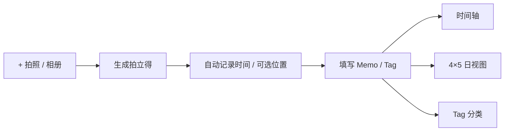

# 时光拍立得 · Hourly Photo Diary

> 用照片而不是任务填满一天：按小时记录，在时间轴、日视图和 Tag 中重新发现生活。

[](https://expo.dev/)
[](https://reactnative.dev/)
[](https://www.typescriptlang.org/)

**[打开 Web 体验版](https://rdchengcheng.github.io/photo-diary/?demo=1)**

Web 用于快速体验界面和核心流程；相机、系统通知、定位、SQLite 与原生文件能力以 iOS / Android development build 为准。

## 产品定义 / Product Definition

### 一句话 / In one sentence

**时光拍立得把一天按小时展开，让照片自动带上时间与位置，再用可选的 Memo 和 Tag，把散落在相册里的瞬间变成可以回看、成册和打印的私人日记。**

**Hourly Photo Diary unfolds a day hour by hour, anchors each photo in time and place, and turns scattered moments into a private diary that can be revisited, compiled, exported, and eventually printed.**

### 第一性原理 / First principles

人们并不缺照片，缺的是把照片变成“记忆”的低摩擦结构。产品因此只保留四个不可再删的要素：

> **可保存的记忆 = 照片证据 + 时间坐标 + 可选意义 + 再次回看的载体**

People do not lack photos; they lack a low-friction structure that turns photos into memories. The irreducible model is:

> **A durable memory = visual evidence + a point in time + optional meaning + a form worth revisiting**

- **照片 / Evidence**：现场拍摄或从相册补录真实片刻。 Capture now or backfill an authentic moment.
- **时间 / Context**：系统自动记录时间，可选记录位置。 Time is automatic; location is optional.
- **意义 / Meaning**：Memo 和 Tag 不强迫填写，只在用户愿意时补充语义。 Memo and tags remain optional, never homework.
- **回看 / Retrieval**：同一份数据可按时间轴、一天或 Tag 重新组织。 The same memory can be revisited by timeline, day, or tag.

### Design Thinking 定义 / Human-centered definition

| 阶段 | 中文 | English |
| --- | --- | --- |
| **Empathize · 共情** | 普通生活值得记录，但长篇写日记难以坚持；手机照片很多，却常沉入相册。 | Everyday life deserves remembering, but long-form journaling is hard to sustain and camera rolls become forgotten archives. |
| **Define · 定义** | 为想保存日常、又不想承担记录压力的人，提供一种私密、快速、带时间感的照片日记。 | Give people who value ordinary moments a private, fast, time-aware diary without turning memory into a chore. |
| **How might we · 设计命题** | 如何让一次拍照自然成为可追溯、可回看、最终可触摸的一页日记？ | How might one captured moment become a traceable, revisitable, and eventually tangible diary page? |
| **Ideate · 构想** | 以“小时”作为稳定地址，自动保存客观信息，把主观表达做成可选项，并提供多种回看方式。 | Use the hour as a stable address, automate objective context, keep reflection optional, and offer multiple ways to revisit it. |
| **Prototype · 原型** | `+ → 拍照/相册 → 拍立得 → Memo/Tag → 时间轴/日视图/Tag`。 | `+ → camera/library → polaroid → memo/tag → timeline/day/tag`. |
| **Test · 验证** | 关注记录完成率、从打开到保存的时间、主动填写 Memo/Tag 的比例，以及用户是否愿意回看和导出。 | Measure capture completion, time-to-save, voluntary memo/tag use, and whether people return, export, and preserve their diary. |

### 产品承诺 / Product promise

- **低摩擦 / Low friction**：右下角 `+` 完成现场拍照或相册补录。
- **有时间感 / Time-aware**：每天是连续 20 个小时，跨午夜仍可属于同一个日记日。
- **可重新发现 / Rediscoverable**：按日期、小时或 Tag 回看同一份记忆。
- **本地优先 / Local-first**：默认不要求账号，不把私人生活变成公开内容。
- **不是 / Not**：不是任务日历、社交动态或要求每日完成的打卡工具。 Not a task calendar, social feed, or mandatory streak.

## 核心体验



- 时间轴：20 个小时节点；多图自适应平铺或叠放。
- 拍立得：每张照片独立保存时间、位置、Memo、Tag 与补录状态。
- 日视图：固定 `4×5` 网格，加一段独立的“今日总结”。
- Tag：可创建、复用、重命名、删除，并提供“未标记”入口。
- 本地优先：无账号、无自动云同步，离线仍可记录和回看。
- 主动备份：AES-256-GCM 加密导出与恢复。

## 未来路线图 / Future Roadmap

路线图遵循同一条主线：**先让记录更像手账，再让手账成为可保存的文件，最后成为可以拿在手里的实体日记。**

The roadmap follows one progression: **make capture feel like journaling, turn journal pages into lasting files, and turn those files into physical keepsakes.**

### 1. 更像手账 / A richer journal surface

- 压缩时间轴行距和空时段高度，在一屏内预览更多小时，同时保留有照片时的拍立得展开感。 Compress empty-hour spacing so more of the day is visible without shrinking meaningful moments.
- 将日视图美化为一整页手账纸：纸张纹理、胶带、贴纸、手写感标题、天气和心情等可选元素。 Restyle the day view as a full scrapbook page with paper texture, tape, stickers, handwritten accents, weather, and mood.
- 提供克制的主题与版式系统，允许个性化但保持内容优先。 Offer restrained themes and layouts that personalize without overwhelming the memories.

### 2. 从页面到作品 / From pages to keepsakes

- 将单日手账导出为高清图片或 PDF，所见即所得。 Export a daily page as a high-resolution image or print-ready PDF.
- 按周、月、年自动编排封面、目录、日期页和精选片刻，形成数字小册子。 Compile weekly, monthly, and yearly booklets with covers, indexes, dated pages, and highlights.
- 支持尺寸、页边距、出血线和色彩等打印参数，让数字日记能够可靠印刷。 Add page size, margins, bleed, and color controls for dependable printing.
- 未来可接入照片书服务，或导出标准印刷包，由用户自由选择打印渠道。 Optionally connect to photo-book services or export an open print package without vendor lock-in.

### 3. 更容易找回与整理 / Better rediscovery and stewardship

- 日历、地图、Tag、收藏与全文搜索，帮助找回某个季节、地点或人物。 Calendar, map, tags, favorites, and search for rediscovering a season, place, or person.
- “去年今天”、月度回顾和年度回忆，但不以连续打卡制造压力。 Gentle resurfacing such as “on this day,” monthly reflections, and yearly memories—without streak pressure.
- 可选的端侧智能：辅助选图、生成标题、建议 Tag 和版式；默认保持隐私并允许完全关闭。 Optional on-device intelligence for curation, captions, tags, and layout, private by default and fully switchable.
- 在本地优先前提下提供加密跨设备同步、开放导入导出，以及可选的私人家庭合册。 Add encrypted sync, open import/export, and optional private family books without abandoning local ownership.

## 架构

```text
src/
├─ domain/    20 小时时间规则与业务模型
├─ data/      Repository、SQLite 与 Web 适配器
├─ services/  媒体、通知、位置与加密备份
├─ state/     用例编排与应用状态
├─ screens/   时间轴、日视图、Tag
└─ ui/        拍立得、编辑器、骨架屏与导航
```

边界保持简单：展示层不直接操作存储，原生能力经 Service 隔离，业务规则保持可测试。

## 本地运行

要求 Node.js `22.13+` 与 pnpm `11.19+`。

```bash
pnpm install --frozen-lockfile
pnpm web
```

打开终端给出的地址；追加 `?demo=1` 可载入演示数据。

原生 development build：

```bash
pnpm exec expo run:android --device
pnpm exec expo run:ios --device
```

## 验证

```bash
pnpm check
pnpm export:web
```

当前状态：TypeScript、Vitest、Expo 依赖检查和 Web / Android / iOS bundle 已通过；权限、通知、相机、定位、故障恢复和终端适配仍需分别完成 Android / iOS 真机签字。

## 产品边界

一期不包含社交、公开分享、AI 分类、云同步和多用户协作。Web 体验版的数据保存在当前浏览器中，不与其他访问者共享。
